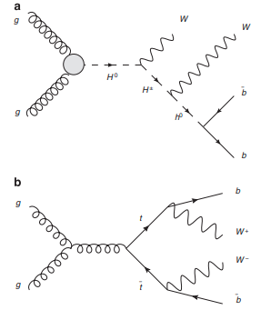

# Higgs Classification Project

Click the button below to open the notebook in Google Colab.

**References:**

Baldi, P., Sadowski P., and Whiteson D. “[Searching for Exotic Particles in High-energy Physics with Deep Learning.](https://www.nature.com/articles/ncomms5308)” Nature Communications 5 (July 2, 2014).
